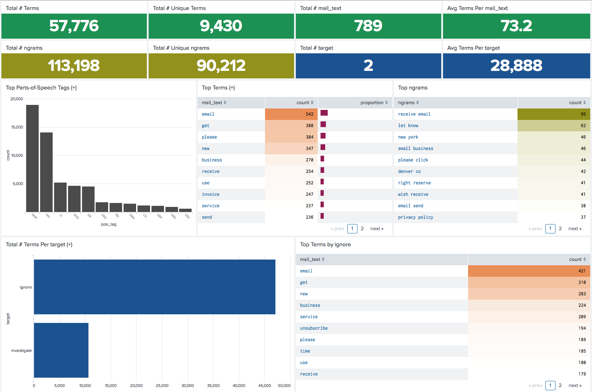
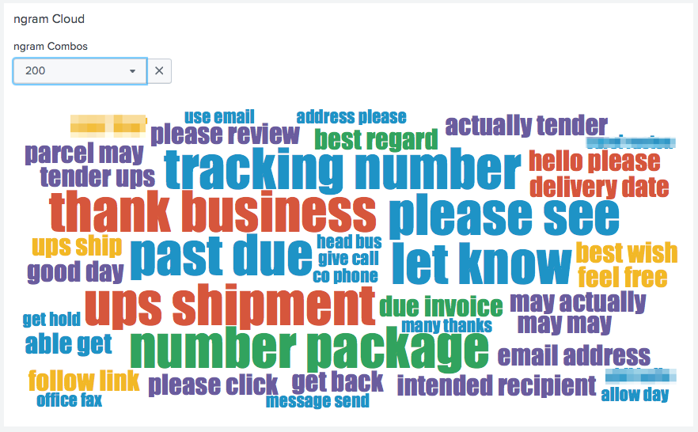
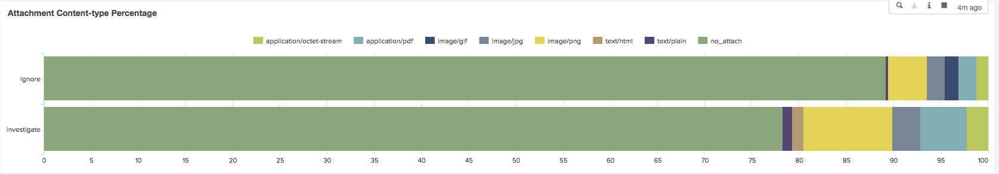
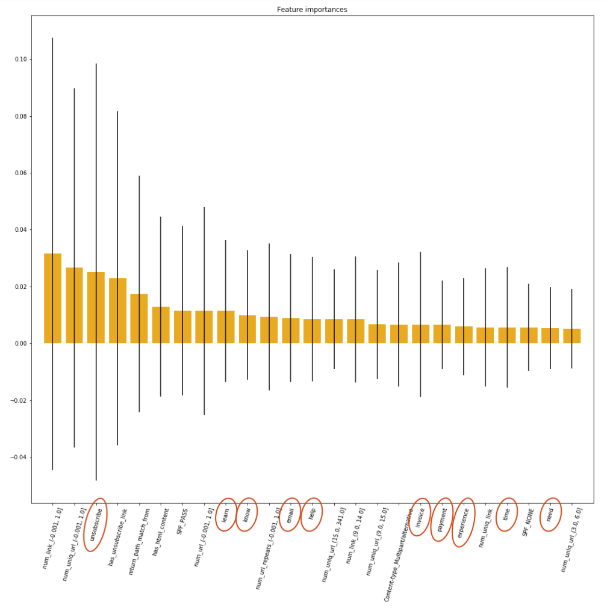
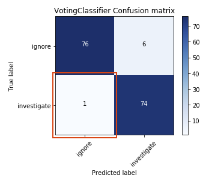
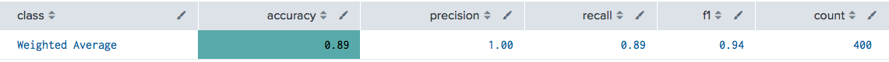

# Ham, Spam... or Sham

##### Author: Nathan Worsham
##### Created for MSDS692 Data Science Practicum II at Regis University, 2018
##### [YouTube Presentation](https://www.youtube.com/watch?v=hXnPGzBn0zQ)

In the dawn of spam filtering there was a standard juxtaposition of ham versus spam, with "ham" meaning good email and "spam" meaning unwanted email. This categorization however, roles up malicious and junk emails together under the "spam" umbrella. Though it is a different branch of spam email, a more malicious sort that often looks like the real thing is called "phishing" or sometimes "spear phishing" when it is extremely targeted.  Phishing is when an attacker or bad actor (note these are fancy security euphemisms for evil) uses an email message in attempt to trick a user to reveal any sort of information--including a username and password--or to get the user to do an action on the actor’s behalf--like wire them money or send them employee W2s, often with links to a fake website that is masquerading to look like it is legitimate (Moramarco, n.d.). Where I work at we use a product called KnowBe4 (https://www.knowbe4.com/) which is primarily used for security awareness training (where we phish our own employees) but it also provides our employees with an option in their email to report something they think is a possibly a phishing email. The problem that happens however, is that often employees don't necessarily understand the difference and will report emails that are simply regular spam emails or emails that the employee is part of a mailing list and not someone trying to scam them.  This causes a lot of noise and requires a security resource to look over the email and decide if it should either be ignored or investigated further.

This creates a classic binary classification problem, that may be able to be solved with machine learning and free up resources. It is the over arching problem this project proposes to see if can be done, though as a secondary portion of the project I also want to know/see if the final model chosen can be run on Splunk. If you see my [Practicum I project](https://github.com/geekusa/nlp-text-analytics), you may gather I am a Splunk fanatic. Though that may be true, I like seeing what new levels I can push it to. In that first practicum I built tools to help facilitate text analytics inside of Splunk and since the emails for this project will require analyzing and cleaning the text held within, the two practicums go together nicely. Splunk's data pipeline is easy to maintain and a known entity in our organization, so if the model works in Splunk it could be operationalized there, and stand a better chance of it being maintained by other coworkers rather than just me or spark interest for other problems that could be solved in similar fashion.

## Data Cleaning
I had a SOC analyst collect and label a sampling of these emails. I have a bit over 5200 emails collected in their raw form--.eml files. Around 4700 of these are in the "ignore" category but many are duplicates as more than one employee will send the same email and I have a little over 500 of the "requires investigation emails”.

This project tried its hardest to live up to the 80/20 rule in data science where supposedly 80% of your time is spent cleaning and munging the data. I had to keep coming back to fix new flaws that I found. For starters, every email was an attachment to another email--actually to be more correct, a few were not and because of this, those were not usable for this purpose because they lacked the original header information. Later I had to go through each of the investigate emails with a fine toothed comb... the poor comb is now in shambles.

Here I used Jupyter Python notebooks ([found here](https://github.com/geekusa/combined-feature-classifier/tree/master/PYTHON_NOTEBOOKS/CLEANING)) to keep track of my cleaning. As mentioned, I had to come back several times and re-clean, so the only notebooks there are only from the final cleaning. Between cleanings--when my hopes weren't dashed because I thought I was finally done with cleaning--I would index the data into Splunk so that I could analyze it, but if I found and issue then I had to delete the data and reindex. Okay so in Splunk, when you delete data, you really are just removing the data from being searchable until the data ages out, but it is like the magician made the rabbit disappear and then he can never, ever make it reappear. Later when I ran into a data leakage issue--more on that in a bit--I was able to add some further investigate emails.

#### SA-mailparser_plus
I learned of a great python library called `mail-parser` (Mantuano, 2016/2018; stackoverflow.com, 2015) and like my previous practicum, I decided to build a [Splunk app](https://splunkbase.splunk.com/app/4129/) with that would package a custom command wrapper around this library so it could be used in Splunk. Though I ended up making the command able to do much more than just parse an email. It also brings back all of the features I needed from the email as long as `adv_attrs` is set to True--which is set by default.

#### TA-mailclient
We had been using this app to scrape email boxes. There is another IMAP app on Splunkbase but I seemed to have good luck with this one. However there was a couple peculiar things I learned about this app. 

It re-writes the email. Replaces the MIME boundary with human readable text, reorders the headers, and removes attachments. I needed the removing attachment part but turns out messing with the MIME format too much causes mail-parser not to work. So I ended up creating my own Python script to extract the inner email (as seen in the cleaning notebooks), leave the boundaries and headers alone (including attachment headers)--this allowed mailparser to still fetch the data it needs--and still remove attachments but leave some helpful information in their place including md5 and sha256. Later, I plan on forking the TA-mailclient to make use of this functionality so that my Splunk `mailparser` command will still work.

#### Quoted-printable??
During one of the several runs of deleting the indexed data, re-clean it, and reindex it, I decided to take a look at what I had been seeing all throughout the emails, mainly “=20” and “=3D”. I learned that these are called quoted printables in MIME formats and used a library to remove them called “quopri” (stackoverflow.com, 2008). Eventually, I realized in every email where the text portion is, it clearly states “Content-Transfer-Encoding: Quoted-printable” which is the hint that they all do this, or a hint that I am not an email expert.

## Data Exploration
In the last practicum as mentioned prior, I built a Splunk app called [NLP Text Analytics](https://splunkbase.splunk.com/app/4066/), and here I used a portion of that app--specifically the _Counts_ dashboard to look at the textual features of the set.

_Complete Set (Under-Sampled Majority) Term Counts_


The set is heavily dominated by the ignore category which is why it is under-sampled here so that investigate emails would not be flooded out. The top terms for ignore are nearly identical to the top terms of the set, which has to do with the discrepancy in the amount of terms per category.

However it is interesting to see the different top terms for each category. The ignore category seems to be dominated by marketing emails, something which was very common to find in the ignore set. The words "unsubscribe" and "receive" look like they are doing their CAN-SPAM ACT due diligence. Looking at investigate emails, we can see some of the suspicious nature for the investigate category by it's top terms like "invoice", "payment", "send" and possibly "number". 


Looking at just investigate's counts we see the average length of the email--Average Terms Per mail_text--have gone way down, suggesting that suspicious emails tend to be shorter. The average for ignore on its own is around 129.  

_Investigate Counts_


The ngrams for investigate bring out a different tactic. While it still definitely shows a relationship with money with one of the top ngrams being "past due". But we see a heavy amount of package delivery themed emails standing out--another favorite technique of phishing.

_Investigate Ngram Word Cloud_
 

Next I moved onto exploring the data features that were not text. I created a new Splunk dashboard to make exploration easier, repeatable, and as just a landing space for all thoughts in one plase ([xml for the Splunk dashboard here](https://github.com/geekusa/combined-feature-classifier/blob/master/SPLUNK_CONTENT/EDA_dashboard.xml)) Here is where a SOC analyst may spend a decent amount of time, under the hood of the email able to see the secrets it is hiding. Changing these into numeric features often resulted in the length of something, quantity of something occurring (along with the unique quantity of something occurring) and whether or not an email has some feature or not. 

One feature that immediately stood out to me and was a bit surprising at first was the length of the body from the email. 


Ignore emails body length where more often substantially longer than investigate emails and a great indicator of class. In fact the inner quartile ranges of the two classes' body lengths did not overlap either. Stopping to think about this it seems to be the human element at play here. It would seem that more often than not those behind doing something nefarious with email tend to go the easier route and write shorter emails in order to get a user to do something, whereas an ignore email which often is a marketing email, is filled to the brim with html formatting to make their emails try to stand out as much as possible. This professional html formatting really pushes the length of the email. Subject length here also shows a similar case but not nearly as such a clear divider.

Another interesting though not really surprising find, is that investigate emails are more likely to have an attachment. This visualization is in percentage (like a pie chart--the black sheep of statistical visualizations).


Unsurprising, because often to accomplish an attack requires a user to execute code, though this can be done with a link, which then downloads and executes the code as well this is a good'ol standby.

TLD which stands for Top Level Domain, in this case is the domain that the from address is using. Looking further into this aspect, the TLD is heavily dominated by ".com" but using a different domain is a common way to spoof or masquerade as an official address. Though when seeing this visually and comparing the two classes, we see that ignore emails are likely to have come from a `.com` address, whereas investigate emails may come from a much larger variety of TLDs.


Though what is also interesting here is that `.net` and `.org` swap places of importance between the two categories and `.net` in general, has greater prominence in the investigate emails.

## Problems Encountered 

One problem I did not quite uncover during EDA but showed up during ML modeling was a data leakage problem. When a large scale phishing campaign is done, commonly the phisher is going to send very similar or the exact same emails to many recipients. If more than one user alerts on the same email and both emails make it into the dataset, specifically one in the training set and one in the testing set, then the model has an unfair advantage at predicting the email that it really has already seen. On the flip side however, I also found emails with exact same or very similar subjects that clearly were apart of the same campaign but a much different story inside of them. Here is an example of one of these types (using the unix `diff -y` command to compare the emails side-by-side):


Here we see the emails are similar but yet they are different enough to both be included in the dataset considering they have enough differentiating attributes--like text body, from TLD, even day of the week and time of day. Why do bad phishers do this? My intuition is that they are trying to evade signature detection as probably their first objective, but perhaps an auxiliary reason might be to evade human detection in case co-recipients talk and compare notes. Regardless, I went through each email that had the exact same subject line or a very similar subject line in order to remove true duplicates which was time consuming. 

Another issue that I had to deal with was an imbalanced dataset which was mentioned earlier in the EDA section. There are plenty of real-world problems in which the event of interest is an uncommon one such as credit card fraud (Chawla, Bowyer, Hall, & Kegelmeyer, 2002). However to get a model to be able to accurately detect the event and not be influenced too heavily by the negative class, over-sampling or under-sampling must take place in order to strike a balance. I tried using a combination of under-sampling the majority class and SMOTE or Synthetic Minority Over-sampling Technique on the positive class (Chawla, et al., 2002). However, I received better results by just using under-sampling of the majority class, granted this did cause a much smaller dataset than I would have liked.

## ML Modeling
I started the modeling by just working with the non-text features to see how well the predictive power stood of those features by themselves. Earlier in the EDA, section I showed non-text features like body and subject length, along with the sender's TLD. I also created many other numerical attributes to feed the model, such as number of links (meaning HTML `<a>` tags) and number of email addresses found. 

One benefit of the much smaller dataset is that it did leave the potential for trying a broad spectrum of algorithms due to the small amount of time involved to crunch numbers. Though of course if the set was bigger, one could always do the same with just a sample of the larger set, in fact that is a good practice to be in the habit of. I ended up creating separate Jupyter notebooks for each of my trials ([found here](https://github.com/geekusa/combined-feature-classifier/tree/master/PYTHON_NOTEBOOKS/FEATURE_TRIALS)). Nonetheless, I ended up with a lot of notebooks because of this. I found it was easy to copy a notebook and then make some tweaks, then set it aside and then come back to it later when I needed to reference it. This did however cause issues when I wanted to make changes to the existing code, which meant either going back and fixing it in multiple locations or allowing it to drift. 

#### Algorithms Tried

The following is the list of algorithms I tried with each set--though there were a couple of algorithms that simply don't work with a certain feature sets (such as MultinomialNB, as will not take a negative input value).  
```
LinearSVC
SVC with RBF Kernel
ExtraTreesClassifier
GradientBoostingClassifier
XGBClassifier
MLPClassifier
MultinomialNB
GaussianNB
RandomForestClassifier
KNeighborsClassifier
NearestCentroid
AdaBoostClassifier
QuadraticDiscriminantAnalysis
GaussianProcessClassifier
DecisionTreeClassifier
LogisticRegression
BaggingClassifierPassiveAggressiveClassifier
RidgeClassifier
SGDClassifier
CalibratedClassifierCV

```
I created a function to collect the scores from each algorithm's performance and then later sorted the output to show the top 3 algorithms for that feature set on a particular measure--accuracy, F1, and number of false-negatives.

#### Initial Feature Sets

The different feature sets I tried were:

* Non-Text Features Dense
    * I say dense here because I left continuous variables alone (like body length) and then did one-hot encoding for categorical values. Of all of the tests I ran, this feature set performed the worst but still predicting with over 90% accuracy.

* Non-Text Features Binary
    * Here I did not leave continuous variables alone and cut them into ranges and then did one-hot encoding for them and the categorical values so all I was left with was a sparse data frame of 1s and 0s. I used a combination of `cut` or `qcut` from pandas to make the ranges. Pandas `qcut` chops continuous data into quartiles, but this doesn't also work well when there are severe outliers or not much range at all.  This performed much more balanced than the dense non-text features, as more algorithms overall scored well with this feature set.

* Text Features, Cleaned, Lemmatized and No Stop words TFIDF
    * Going with the traditional sparse matrix that `TFIDFVectorizer` creates, though I elected to use my own cleaning function. In my cleaning function it removed URLs, email addresses, punctuation and numbers. Next, the set was also lemmatized using the `spaCy` library and stop words removed (using the `spaCy` list as well). I chose to use an ngram range of 1-3 for this feature set.

* Text Features, Cleaned, Lemmatized and No Stop words TF Binary
    * Similar to the set just mentioned, ngrams still set at 1-3, but here I turned off the option of `idf` (or Inverse Document Frequency), `norm` is sent to `None` and set the `binary` option to true. This set just accounts if a word is in the document or not and creates a simple DTM or Document Term Matrix of ones and mostly zeros. When I first started trying to fulfill this idea, I neglected to set `norm` to `None`, leaving a default value of `l2`. Though this still causes binary behavior at one point in the process, the output still remains normalized and similar looking to the previous set. Once I figured out my folly, I then created notebooks that would reference "CompleteBinary" as the set truly and finally was binary--unfortunately this was one of the things I didn't notice until I was trying to move into Splunk so it is very pervasive throughout my notebooks. 

* Text Features, Cleaned, Lemmatized and Keep Stop words TFIDF
    * Similar to the first text set but leaving stop words included and because of this I changed the ngram range to 1-4. This set naturally had a lot of features because of this, but the predictive power did not see any impressive increases, so it did not seem worth leaving in stop words for the extra compute time that it causes.

* Text Features, Cleaned, Lemmatized and No Stop words TFIDF, LSA
    * Finally, also like the first set but then running the final output through the `TruncatedSVD` algorithm to accomplish LSA or Latent Semantic Analysis. LSA is used in attempt to score words by their meaning in context (Landauer, Foltz, & Laham, 1998). This changes the sparse set into a dense one. I would have thought that this set would outperform the other text sets but I was disappointed, possibly an issue here however is that LSA may perform better on a larger set.

#### Combined Features 
I had trouble finding solid examples of the best way to go about combining text with non-text features. In the end I settled on the concept that in order for it to work, I would either need to make the non-text features sparse, or I would have to make text features dense in order to add them together (stackoverflow.com, 2018). This is so that the dense features do not dominate the sparse features if I were just to combine them as is. I did see and try one idea to have one feature set's prediction be a feature for another set or another idea to have them vote against each other. I moved away from these ideas quickly however because I felt that this would not give them equal footing against each other. Since the concept I wanted to model this after is the mindset that a SOC analyst would take on these emails, I felt it was important for both feature sets to be taken into account so that the whole picture would used to make decision.

* Combined Features Dense
    * This set is a combination of the first non-text set and the LSA set for text features. In order to get the LSA features to merge with the others, I had to change the LSA features back into a data frame.

* Combined Features Spare/Binary
    * This set is a combination of the non-text features changed to binary (second non-text set) with the first text set that is a TFIDF. Again the TFIDF is changed back into a data frame in order to combine. This ended up being one of the final two feature sets chosen to work with.

* Combined Features Binary/Binary
    * The final set of features I chose to work with was likewise a combination of the non-text features changed to binary and the Document Term Matrix binary text set. Like in the previous combination sets, the text feature set is changed back into a data frame in order to combine. This was the final of the two feature sets chosen to move forward with.

#### Hyper-parameter Tuning and Final Trials 
I selected two feature sets and three algorithms to explore further because to their performance and stability against this dataset. The two feature sets as just mentioned were "Combined Features Spare/Binary" and "Combined Features Binary/Binary". The three algorithms selected were LinearSVC, ExtraTreesClassifier, and MLPClassifier.

I first worked on tuning the hyper-parameters of the algorithms with the feature sets ([notebooks found here](https://github.com/geekusa/combined-feature-classifier/tree/master/PYTHON_NOTEBOOKS/HYPERPARAMETER_TUNING)) using GridSearchCV. Here I ran into two different issues both centered around the problem of grid search completely hanging. Each issue was different. 

The first issue was with LinearSVC, I could not make heads or tails out of the problem because the algorithm itself completed in seconds. After some digging I was able to find a [Github issue](https://github.com/scikit-learn/scikit-learn/issues/8918) that stated `return_train_score` is by default set to True and could cause this sort of response. Changing this setting to False fixed the problem and sure enough the documentation talks about performance of the option with plans to change its default to False in the future (scikit-learn developers, 2017). 

The second issue was with MLPClassifier. Same hanging behavior but I already had set `return_train_score=False`. Digging again, after a combination of turning on debugging on both grid search and the algorithm,  then finding this [Github issue](https://github.com/scikit-learn/scikit-learn/issues/5115) tipped me off. I found that the problem was with multi-threading. After setting `n_jobs` to 1, I could finally get GridSearchCV to complete.

Now that I had tuned hyper-parameters, I tried multiple trials with each algorithm individually and with the VotingClassifier made up of the three tuned algorithms ([notebooks found here](https://github.com/geekusa/combined-feature-classifier/tree/master/PYTHON_NOTEBOOKS/FINAL_TRIALS)). I then finished by taking the voting classifier made up of all three and running cross-validation on it. I had intended on doing the voting in the first place to create an ensemble classifier. This was also why I chose both an odd number of algorithms (so I could have a majority) and why I chose three algorithms that were very different from each other. I then ran 10-fold cross-validation. Looking at their cv results:

_Combined Features Spare/Binary Cross-Validation_


_Combined Features Binary/Binary Cross-Validation_


So I was left ultimately with two very similar performing algorithms. Since I was using a tree classifier however, this allowed me to be able to get the `feature_importances_` for each feature set.

_Combined Features Spare/Binary Feature Importances_


_Combined Features Binary/Binary Feature Importances_


The important issue I found here was that the binary/binary model was taking into account much more terms in its top feature importances than the sparse/binary set--specifically 10 vs 1. This was the behavior I was after in a model--which I have mentioned multiple times--one that would give equal significance to both set of features.

Furthermore, I had one other reason to select the binary/binary set. In security, in many cases there is more concern with false-negative performance than with false-positive performance. Granted false-positives lead to alert fatigue, something no one likes and the basis for a whole other conversation, but a false-negative in this case would be one where the algorithm classified an investigate email incorrectly as an ignore email--meaning that we would not be alerted at all. Looking at the false-negative performance of the two feature sets using a confusion matrix:

_Combined Features Spare/Binary Confusion Matrix_


_Combined Features Binary/Binary Confusion Matrix_



Here we see that the binary/binary feature set has better false-negative performance--one less. Taking these two reasons into account, I now had a clear winner in my mind, the combined binary/binary feature set.

## Move to Splunk

Now that I had the model (or rather models since we are talking about voting) I planned to use, the final portion of the project was that I wanted to see if I could get the same algorithms working in Splunk. Recently, Splunk upgraded both their underlying scientific computing Python app and Machine Learning Toolkit (MLTK) app, this worked out in my favor as this was the only way I was going to be able to use the MLPClassifier which had a dependency on the version of sklearn. Though now that Splunk's MLTK offered the MLPClassifier algorithm out of the box, it still did not have several algorithms that I needed to complete the move. Fortunately, in the last practicum, I had gained experience with adding algorithms to MLTK. So I ended up adding four more algorithms to the app ([NLP Text Analytics Splunk App](https://splunkbase.splunk.com/app/4066/)) that I had made in that practicum as in my mind they are related and seemed like as good a place as any for the algorithms to live. 

I added the algorithms LinearSVC, ExtraTreesClassifier, and MinMaxScaler. The last algorithm I needed already existed in Splunk's MLTK which was TfidfVectorizer, but as of version 3.4, it was missing two options that would allow a binary output. Because of this I added a customized version of TfidfVectorizer, called TFBinary, that allowed and set as defaults these options to force binary output.

I then provided the Splunk algorithms the same tuned hyper-parameters that I gave Python.


I also tried adding the `VotingClassifier` algorithm, however this algorithm takes other algorithms as arguments. I tried various ways (syntax) of trying to get it to work, but gave up and chalking it up to the fact that Splunk's MLTK's API does specific formatting to arguments provided and currently is simply not possible. Though another reason I was quick to give up was that I knew I could just implement a simple hard vote (meaning majority wins) using a Splunk `eval` statement (VotingClassifier also offers a "soft" voting option).


One unsettling result that happened was after doing my 80/20 split in Splunk, training my models, and then pitting them against the 20 percent test set, it kept doing perfect predictions on the 20 percent test set.


I repeated this exercise several times with different seeds and still received the same results. Though I am not 100% sure what is going on here, one thing I do know is that MLTK is really an abstraction layer to Python, therefore there are going to be some changes and settings going on under the hood that do not exactly match what I was doing in my notebooks. 

However, as a sanity check, I took 400 of the ignore emails that the models had not seen--since I had a large stash of those lying around. 



Seeing these results, the performance was much more in-line with what I would expect. Of course the incorrect classifications in this case would be false-positives but as that was all I had, I took it as a sign I was on the right course. 

It was interesting doing a comparison of how the Python workflow compared to that of Splunk. They contain essentially the same steps, but the order of operations moves around a bit. In Splunk though, all of the steps become a single search. The Splunk searches that were used to test, train, and apply can be [found here](https://github.com/geekusa/combined-feature-classifier/blob/master/SPLUNK_CONTENT/savedsearches.conf).

## Conclusion

I found that combining text and non-text features provided a better overall model with this data set. Modeled itself after the workflow of a SOC analyst, taking into account all aspects of an email in question. I was pleased with the performance of using machine learning against this problem, with over 90% accuracy and good false-negative response. I feel like this model can start providing a benefit right away in production. I was equally pleased with the experience of moving the models into Splunk. As mentioned, I can then take advantage of Splunk's pipeline and sharing the "search" with others who are not familiar with Machine Learning or even Python might be more inclined to understand what is going on or at least peak their interest.

## Future Work
As more data comes in over time, I will want to continue to improve the model and provide a way for our SOC to keep on training the model. This could probably be accomplished by appending to a lookup the data source that for example was classified incorrectly--maybe a Splunk "workflow action" will be the way to go. 

I feel there is room to bring in further features into the model. I did not deal with multi-valued fields in this iteration as the [SA-mailparser_plus](https://splunkbase.splunk.com/app/4129/) app I created as an example will return a multivalued field with all of the URL lengths. Though more features don't necessarily mean a better model, but in this case I think it could help add to the totality of lenses with which to look through at the emails.

## References
See https://github.com/geekusa/combined-feature-classifier/blob/master/PROJECT_FILES/References.md for the list of references for this paper and project.
