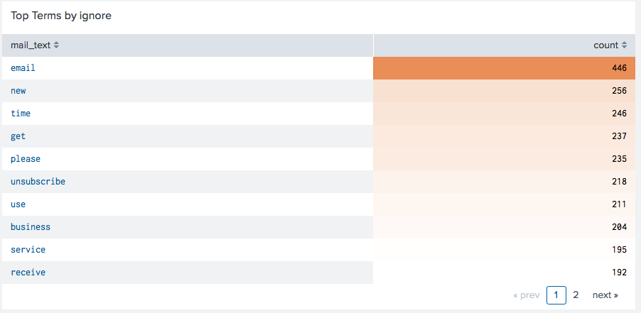
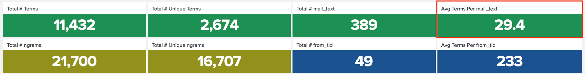

# Ham, Spam... or Sham

##### Author: Nathan Worsham
##### Created for MSDS692 Data Science Practicum I at Regis University, 2018

In the dawn of spam filtering there was a standard juxtaposition of ham versus spam, with "ham" meaning good email and "spam" meaning unwanted email. This categorization however, roles up malicious and junk emails together under the "spam" umbrella. Though it is a different branch of spam email, a more malicious sort that often looks like the real thing is called "phishing" or sometimes "spear phishing" when it is extremely targeted.  Phishing is when an attacker or bad actor (note these are fancy security euphemisms for evil) uses an email message in attempt to trick a user to reveal any sort of information--including a username and password--or to get the user to do an action on the actor’s behalf--like wire them money or send them employee W2s, often with links to a fake website that is masquerading to look like a message that is legitimate (Moramarco, n.d.). Where I work at we use a product called KnowBe4 (https://www.knowbe4.com/) which primarily used for security awareness training (where we phish our own employees) but it also provides our employees with an option in Outlook to report something they think is a possibly a phishing email. The problem that happens however, is that often employees don't use it correctly and will report emails that are simply regular spam emails or emails that the employee is part of a mailing list and not someone trying to scam them.  This causes a lot of noise and requires a security resource to look over the email and decide if it should either be ignored or investigated further.

 This is a classic binary classification problem, that might be able to be solved with machine learning and free up human resources. Though it is going to require analyzing the content (language) of the emails as well.
 
I have had an SOC analyst collect a sampling of these emails, I have a bit over 5200 emails collected in their raw form--.eml files. Around 4700 of these are in the "ignore" category but many are duplicates as more than one employee will send the same email and I have a little over 500 of the "requires investigation emails”.  I want to possibly use Splunk for this as this is a known entity in our organization and if it could be operationalized there, the better chance of it being maintained by other coworkers and because I love working with Splunk and pushing it to new limits. That being said I also plan I trying to create the model in a Python notebook as well to see how they might compare. During the last Practicum project I built some pieces in Splunk that will help with this project.

## Data Cleaning
This proved to live up to the 80/20 rule of data science where 80% of your time is spent cleaning the data. I had to keep coming back to fix new flaws I found in the data. For starters every email was an attachment to another email--actually to be more correct, a few were not and because of this where not usable for this purpose because they lacked the original header information. Later I had to go through each of the investigate emails with a fine toothed comb.

#### SA-mailparser
I learned of a great python library called `mail-parser` and like my previous practicum, I decided to build a custom command wrapper around this library so it could be used in Splunk. Though I ended up making the command to so much more than just parse an email. It also brings back all of the features I needed from the email as long as `adv_attrs` is set to True--which it is by default. 

#### TA-mailclient
We had been using this app to scrape email boxes. There is another IMAP app on Splunkbase but I seemed to have good luck with this one. However there was a couple peculiar things I learned about this app. 

It re-writes the email. Replaces the MIME boundary with human readable text, reorders the headers, and removes attachments. I needed the removing attachment part but turns out messing with the MIME format too much causes mail-parser not to work. So I ended up creating my own Python script to extract the inner email, leave the boundaries and headers alone (including attachment headers)--this allowed mailparser to still fetch the data it needs--and still remove attachments but leave some helpful information in their place including md5 and sha256.

#### Quoted-printable??
In one of the several runs of deleting the indexed data, re-clean it, and reindex it I decided to take a look at I had been seeing all throughout the emails “=20” and “=3D”, I learned these are called quoted printables in MIME formats and used a library to remove them called “quopri”. Later I realized in ever email where the text portion is it clearly states “Content-Transfer-Encoding: Quoted-printable” which is the hint that they all do this. 

## Data Exploration
In the last practicum I built a Splunk app called [NLP Text Analytics](https://splunkbase.splunk.com/app/4066/), and here I used a portion of this app--specifically the _Counts_ dashboard to look at the textual features of the set.


The set is heavily dominated by the ignore category and will need to be dealt with in the machine learning phase. The top terms for ignore are nearly identical to the top terms of the set.


However it is interesting to see the different top terms for each category. While the _ignore_ category seems to be dominated by advertising, we can see some of the suspicious nature for the _investigate_ category by it's top terms like "invoice", "payment", and "file".


Looking at just _investigate_'s counts we see the average length of the email--Average Terms Per text_plain--have gone way down, suggesting that suspicious emails tend to be shorter. The ngrams definitely show a behavior of trying to coax the user into doing something, though the terms "let know" and "please click" were heavy in the whole set as well suggesting that it is common language to find in these type of emails. 


TLD which stands for Top Level Domain, in this case is the domain that the from address is using. Looking further into this aspect, the TLD is heavily dominated by ".com" but using a different domain is a common way to spoof or masquerade as an official address. Here we can see that using that ".net" definitely uses words that could be trying to get the user to do something like click on a fake invoice.


Not pictured, some other findings are that _ignore_ emails came from 75 different TLDs but is nearly 10 times in size, I would have expected this number perhaps higher. Also at a glance it appears that ".com" from TLD dominates the _ignore_ emails by an even larger margin that _investigate_ but this could be do to the disproportionate sizes. Also curiously the ngram "New York" is the 3rd largest ngram for _ignore_ emails. I wonder if the large 

Next I moved onto exploring the data features that were not text. Here is where a SOC analyst may spend much of their time, under the hood of the email able to see the secrets it is hiding. Changing this into numeric features often resulted in the length of something, the quantity of something occurring along with the unique quantity of something occurring and where or not an email has or has not some feature. Here I ended up under sampling the ignore category so that investigate emails would not be flooded out.

One feature that immediately stood out to me and was a bit surprising at first was the length of the body from the email. 


Ignore emails body length where more often substantially longer than investigate emails. Stopping to think about this it seems to be the human element at play here. It would seem that more often than not those behind doing something nefarious with email tend to go the easier route and write shorter emails in order to get a user to do something, whereas an ignore email which often is a marketing email, is filled to the brim with html formatting to make their emails try to stand out as much as possible. This professional html formatting really pushes the length of the email. Subject length here also shows a similar case but not nearly as such a clear divider.

Another interesting though not really surprising find is that investigate emails are more likely to have an attachment. 


Unsurprising because often to accomplish an attack requires a user to execute code, though this can be done with a link, which then downloads and executes the code as well this is a good'ol standby.

Probably also falling in the not so surprising but good to see it validated visually is the finding that ignore emails are likely to have come from a `.com` address, whereas investigate emails may come from a much larger variety of what is known as Top Level Domains or TLDs.


Though what is also interesting here is that `.net` and `.org` swap places of importance between the two categories.

## Problems Encountered 

One problem I did not quite uncover during EDA but showed up during ML modeling was a data leakage problem. When a large scale phishing campaign is done, often the phisher is going to send very similar and sometimes the exact same emails to many recipients. If more than one user alerts on the same email and both emails make it into the dataset, specifically one in the training set and one in the testing set, then the model has an unfair advantage at predicting the email that it really has already seen. On the flip side however I also found emails with exact same or very similar subjects that clearly were apart of the same campaign but a much different story inside of them. Here is an example of one of these types (using the unix `diff -y` command to compare the emails side-by-side):


Here we see the emails are similar but yet they are different enough to both be included in the dataset considering they have enough differentiating attributes--like text body, from TLD, even day of the week and time of day. Why do bad actors do this? My intuition is that they are trying to evade signature detection is probably their first objective in doing this, but an auxiliary reason might be to evade the human detection in case coworkers talk and compare notes. Regardless I went through each email that had the exact same subject line or a very similar subject line in order to remove true duplicates which was time consuming. 

Another issue that I had to deal with was an imbalanced dataset which was mentioned earlier in the EDA. There are plenty of real-world problems in which the event of interest is an uncommon one such as credit card fraud. However to get a model to be able to accurately detect the event and not be influenced too heavily by the negative class over-sampling or under-sampling must take place to try to make a balance. I tried using a combination of under-sampling the majority class and SMOTE or Synthetic Minority Over-sampling Technique on the positive class. I received better results by just using under-sampling of the majority class, granted this did cause a much smaller dataset than I would have liked.

## ML Modeling
I started the modeling by just working with the non-text features to see how well the predictive power stood of those features by themselves. One benefit of the much smaller dataset is that it did leave the potential for trying a broad spectrum of algorithms due to the small amount of time involved to crunch numbers. I ended up creating separate Jupyter notebooks for my trials. Though I ended up with a lot of notebooks, I found it was easy to copy one and then make some tweaks and then set it aside and then come back to it later when I needed to reference it. This did however cause issues when I wanted to make changes to the existing code, which meant either going back and fixing it in multiple locations or allowing it to drift. 

The different feature sets I tried were:

* Non-Text Features Dense
    * I say dense here because I left continuous variables alone (like body length) and then did one-hot encoding for categorical values. Of all of the tests I ran, this feature set performed the worse but still predicting with over 90% accuracy.

* Non-Text Features Binary
    * Here I did not leave continuous variables alone and cut them into ranges and then did one-hot encoding for them and the categorical values so all I was left with was a sparse data frame of 1s and 0s. This performed much more balanced than the dense non-text features, more algorithms overall scored well with this feature set than the previous dense features.

* Text Features, Cleaned, Lemmatized and No Stop words TFIDF
    * Going with the traditional sparse matrix that the `TFIDFVectorizer` creates, though I elected to use my own cleaning function. Here the function removed URLs, email addresses, punctuation and numbers. The set was also lemmatized using the `spaCy` library and stop words removed (using the `spaCy` list as well). I chose to use an ngram range of 1-3 for this feature set.

* Text Features, Cleaned, Lemmatized and No Stop words TF Binary
    * Similar to the set just mentioned, ngrams still set at 1-3, but here I turned off the option of `idf` (or Inverse Document Frequency), `norm` is sent to `None` and set true the `binary` option. This set just accounts if a word is in the set or not. When I first started trying to fulfill this idea, I neglected to set `norm` to `None`, leaving a default value of `l2` then. Though this still causes binary behaviour at one point in the process, the output still remains normalized and similar looking to the previous set. Once I figured out my folly, I then created notebooks that would reference "CompleteBinary" as the set truly and finaly was.

* Text Features, Cleaned, Lemmatized and Keep Stop words TFIDF
    * Similar to the first text set but leaving stop words included and because of this I changed the ngram range to 1-4.

* Text Features, Cleaned, Lemmatized and No Stop words TFIDF, LSA
    * Finally, also like the first set but then running the final output through the `TruncatedSVD` algorithm to accomplish LSA or Latent Semantic Analysis. This changes the sparse set into a dense one. I would have thought that this set would outperform the other text sets but I was dissapointed.

#### Combined Features 
I had trouble finding solid examples of the best way to go about combining text with non-text features. In the end I settled on the concept that in order for it to work, I would either need to make the non-text features sparse, or I would have to make text features dense in order to add them together. This is so that the dense features do not dominate the sparse features if I were just to combine them as is. I did see and try one idea to have one's prediction create a feature for another set or another idea to have them vote against each other. I moved away from these ideas quickly however because I felt that this 

* Combined Features Dense
    * This set is a combination of the first non-text set and the LSA set for text features. In order to get the LSA features to merge with the others, I had to change the LSA features back into a data frame.

* Combined Features Spare/Binary
    * This set is a combination of the non-text features changed to binary with the first text set that is a TFIDF. Again the TFIDF is changed back into a data frame in order to combine.

* Combined Features Binary/Binary
    * The final set of features I chose to work with was likewise a combination of the non-text features changed to binary the term-frequency binary text set. Like in the previous combination sets the TFIDF is changed back into a data frame in order to combine.

#### Algorithms Tried
The following is the list of algorithms I tried with each set--though there were a couple of algorithms that simply don't work with a features set (such as XGB and MultinomialNB, as it will not take a negative input value). As mentioned previously, I could try so many different algorithms because my set was smaller. Though of course if the set was bigger, I could always do the same with just a sample of it.
```
LinearSVC
SVC with RBF
ExtraTreesClassifier
GradientBoostingClassifier
XGBClassifier
MLPClassifier
MultinomialNB
GaussianNB
RandomForestClassifier
KNeighborsClassifier
NearestCentroid
AdaBoostClassifier
QuadraticDiscriminantAnalysis
GaussianProcessClassifier
DecisionTreeClassifier
LogisticRegression
BaggingClassifierPassiveAggressiveClassifier
RidgeClassifier
SGDClassifier
CalibratedClassifierCV

```
I created a function to collect the scores from the algorithm's performance and then later sorted the output and showed the top 3 for that particular feature set.


#### Final Trials
I selected two feature sets and three algorithms to explore further because to their performance and stability against this dataset. I tried multiple trials with each and also did 10-fold cross-validation. 


## Move to Splunk

Now that I had the model (or rather models) I wanted to use, the final portion of the project was that I wanted to see if I could get the same algorithms working in Splunk.

## Conclusion

I found that combining text and non-text features would provide a better overall model with this data set. In this way model itself after the workflow of a SOC analyst, taking into account all aspects of an email in question. I was pleased with the performance of using machine learning against this problem, with over 90% accuracy and good false-negative response, I feel like it can start providing a benefit right away.

## Future Work
As more data comes in over time I will want to continue to improve the model and provide a way for our SOC to continue to train the model. I feel there is room to bring in further features into the model. I did not deal with multi-valued fields in this model as the SA-mailparser_plus app I created for example will return a multivalued field with all of the URL lengths. 

## References
See https://github.com/geekusa/combined-feature-classifier/blob/master/PROJECT_FILES/References.md for the list of references for this paper and project.
